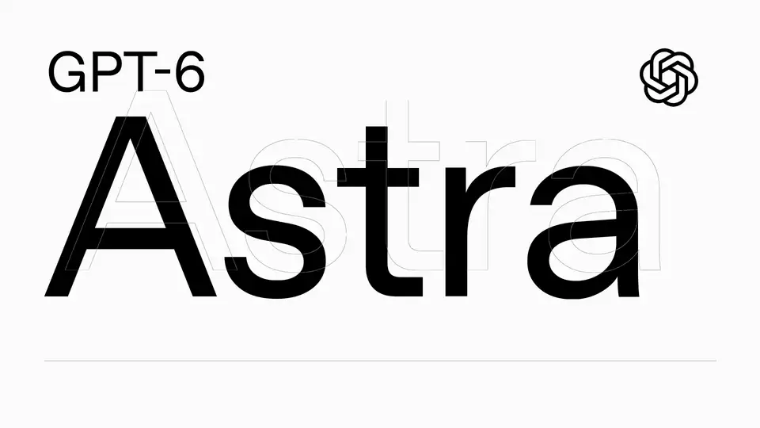

<p align="center">
  <picture>
    <source media="(prefers-color-scheme: dark)" srcset="../docs/logo/dark.png">
    <source media="(prefers-color-scheme: light)" srcset="../docs/logo/light.png">
    
  </picture>
</p>

<p align="center"><b>Video editing for coding agents. Describe the edit; get the MP4.</b></p>

<p align="center">
  <a href="../LICENSE"></a>
  
</p>

<p align="center">
  <a href="#get-started">Get started</a> ·
  <a href="#what-you-can-ask-for">Prompts</a> ·
  <a href="#examples">Examples</a> ·
  <a href="https://www.veed.io">VEED</a>
</p>

OpenEdit is an open-source, agent-driven editing pipeline. There is no GUI and no timeline: you tell
your coding agent what you want, and it transcribes, designs, renders and hands you the file.

## Get started

You need an Apple Silicon Mac (with Homebrew) or a Windows x64 PC, Git, Node 20 or newer, and one of
Claude Code, Codex or Gemini CLI. From your project folder, install the skill into your agent:

```sh
npx skills add veedstudio/open-edit --skill open-edit
```

Then open the agent (`claude`, `codex` or `gemini`) and ask:

```
Add subtitles to my video clip.mp4
```

The first run sets itself up: it checks for Git, Node, pnpm and ffmpeg and names the command for
anything missing (Homebrew or corepack on a Mac; on Windows the commands are printed for you to run,
and ffmpeg is fetched into your user folder with no admin rights), asking before any global install;
clones its runtime into `.open-edit/` inside your project and registers a session hook in the settings
of Claude Code, Codex and Gemini CLI; downloads the renderer into your user's app-data folder; and asks
once how you want speech transcribed. Hosted by VEED
transcribes best (a veed.io account, [sign up](https://www.veed.io/signup) or
[log in](https://www.veed.io/login); the free tier covers about ten minutes a month); WhisperX runs
locally for free (needs `uv` or `pipx`; the first transcription downloads the model, about 2 GB for the
fast tier and more for the better one; nothing leaves your machine); or bring your own service. When the
run finishes you get the MP4 with subtitles burned in, a preview open in your browser, and the path to
the file, which lives under `.open-edit/` in your project.

<a href="https://github.com/veedstudio/open-edit/releases/download/launch-examples/openedit-astra.mp4"></a>

*Made in OpenEdit with GPT-6 Astra driving the pipeline: pure motion graphics, no source footage, prompted
against the [OpenAI Brand Film](https://vimeo.com/1122006941) as a visual reference.*

<a href="https://github.com/veedstudio/open-edit/releases/download/launch-examples/OpenEdit-4x3-trim.mp4"></a>

*The launch video, also made in OpenEdit. Click either one to watch with sound.*

## What you can ask for

Captions are the shortest path, not the limit. The agent can edit, cut and reframe footage, layer
motion graphics and visual elements, turn slides into video, and pull in any
[AI video/image generator](https://www.veed.io/tools/ai-video) or MCP server when it helps. Source
video is optional: stills, slides or generated media are enough when the brief calls for it.

As a first ask:

```
Add subtitles that look like this [IMG-REF] to my video [VIDEO]

Cut the false start and the long pause around 0:42, then caption it

Make a 20-second title sequence for my launch, no footage, in my brand colours
```

On a delivered render:

```
I don't like the yellow colour, make it darker

Move the text up a bit

When he says "go buy it now", make sure the 'now' really stands out
```

No footage at all? It can generate a talking-head clip from a script with
[VEED Fabric](https://www.veed.io/ai/fabric-1-0) and edit that. Generation is billed: it quotes the price
in your workspace's AI Playground credits and spends nothing without your yes.

## Examples

Real outputs, each with the prompt that produced it. Click any example to watch it with sound.

```
create viral subtitles with /open-edit and translate my video to 5 languages using VEED Lipsync 2.0 on Fal
```

One source clip, three languages, three caption styles, translated and re-lipsynced through
[VEED's Lip Sync API](https://www.veed.io/tools/lip-sync-api):

| Spanish | French | German |
| --- | --- | --- |
| [](https://github.com/veedstudio/open-edit/releases/download/launch-examples/happy3-ES-078.mp4) | [](https://github.com/veedstudio/open-edit/releases/download/launch-examples/remix-FR.mp4) | [](https://github.com/veedstudio/open-edit/releases/download/launch-examples/happy2-DE-lowerthird.mp4) |

```
generate 3 viral hooks in Seedance 2.0 on Fal and create dynamic motion graphics using /open-edit
```

Three hooks generated with [Seedance](https://www.veed.io/tools/ai-video/seedance), three
motion-graphic treatments:

| | | |
| --- | --- | --- |
| [](https://github.com/veedstudio/open-edit/releases/download/launch-examples/news-comic.mp4) | [](https://github.com/veedstudio/open-edit/releases/download/launch-examples/chair-remix.mp4) | [](https://github.com/veedstudio/open-edit/releases/download/launch-examples/makeup-happy-v2.mp4) |

```
use Figma MCP to study my BrandBook and create branded campaign graphics using /open-edit
```

One brand book, three campaign cards:

| | | |
| --- | --- | --- |
| [](https://github.com/veedstudio/open-edit/releases/download/launch-examples/race-card-1.mp4) | [](https://github.com/veedstudio/open-edit/releases/download/launch-examples/race-card-2.mp4) | [](https://github.com/veedstudio/open-edit/releases/download/launch-examples/race-card-4.mp4) |

## How it works

The skill tells your agent the whole flow: transcribe with real per-word timings, draw a caption style
from a pool of recipes, compose the document in HTML and CSS, render it with VEED's renderer, then check
the result for timing and contrast before handing it back. Every step of a captioned run is a command
from the `@veedstudio/openedit-cli` package; the [CLI reference](../README.md) lists them.

The renderer is source-available and free to use, and it does not run a headless browser: nothing to
install, launch or keep alive for the length of a render. It does need a desktop session, so renders
run on your machine rather than on a headless box.

Transcription is your choice, asked once and remembered. WhisperX runs locally and nothing leaves your
machine. VEED's hosted transcription uploads the file in order to transcribe it and stores it for that
purpose. Any Whisper-family JSON from your own service works too, and no credentials pass through
OpenEdit. Every provider writes the same `runs/<key>/transcript.json`, and per-word timings are
required: without them the caption reveals drift, so a transcript that has none is refused rather than
rendered badly.

## Requirements

| | |
| --- | --- |
| Platform | Apple Silicon Mac or Windows x64 PC. Intel Macs are not supported: the renderer ships macOS-arm64 and windows-x64 only |
| macOS | Built and tested on Tahoe 26.0. Nothing checks the version, so earlier releases may work, untested |
| Windows | Windows 10 or newer (the installer extracts with the bundled `tar`). Git and Node via winget, pnpm via corepack or npm: preflight prints the exact commands and never runs them itself. ffmpeg is fetched into your user folder for you, no admin rights needed |
| Linux | Planned; prioritisation depends on demand |
| Agents | Claude Code, Codex or Gemini CLI. The installed skill prepares the runtime and loads its `AGENTS.md` instructions itself |

## Scope and limitations

V1 targets captions. Motion graphics, charts, and brandbook-matched styling render today, but are less
exercised than captions and should be expected to have rough edges.

Report defects through GitHub issues.

## License

The editor is licensed under Apache-2.0. The renderer binaries are distributed under PolyForm Shield
1.0.0, which permits commercial use of the videos you produce with no payment to VEED. See `LICENSE`
and `NOTICE` for the full terms.

---

<p align="center"><sub><b>OpenEdit</b> · powered by <a href="https://www.veed.io">VEED</a></sub></p>
