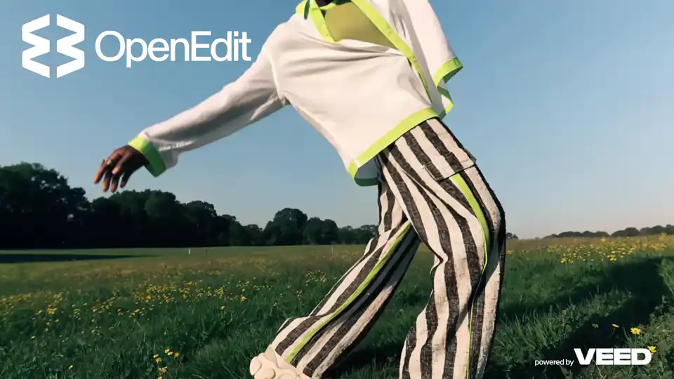
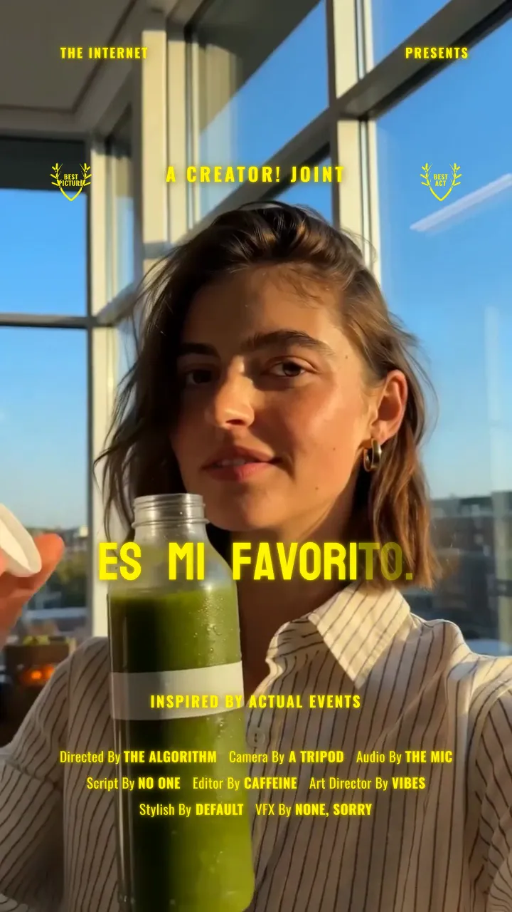
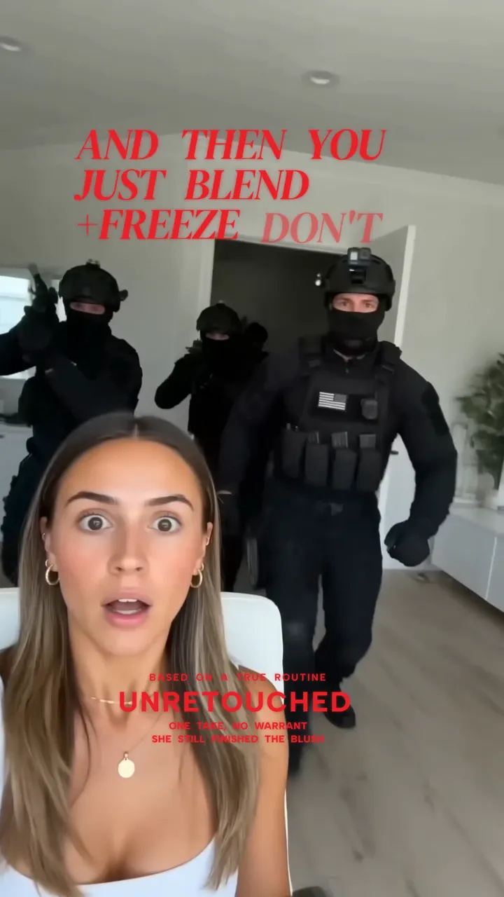
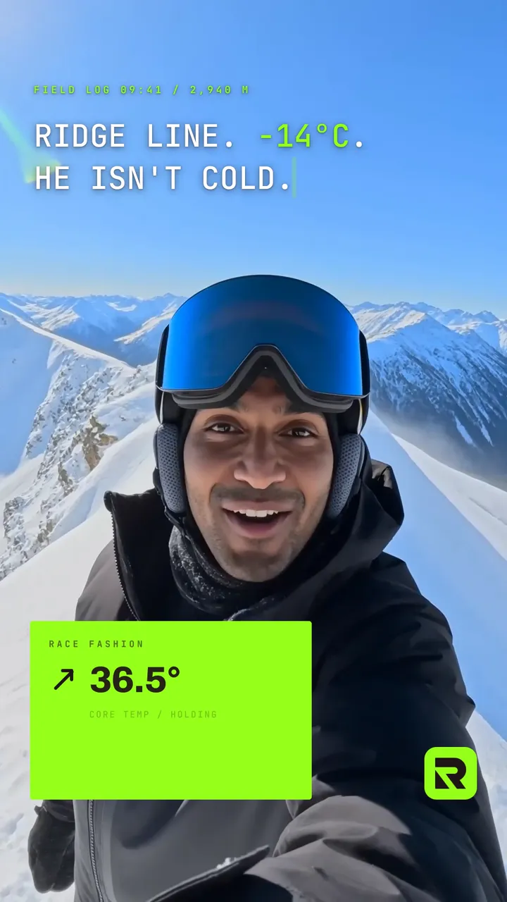

<p align="center">
  <picture>
    <source media="(prefers-color-scheme: dark)" srcset="docs/logo/dark.png">
    <source media="(prefers-color-scheme: light)" srcset="docs/logo/light.png">
    
  </picture>
</p>

<p align="center"><b>Not the editor you rent, but the one you own.</b></p>

<p align="center">
  <a href="LICENSE"></a>
  
</p>

<p align="center">
  <a href="#installation">Install</a> ·
  <a href="#usage">Usage</a> ·
  <a href="#examples">Examples</a> ·
  <a href="https://www.veed.io">VEED</a>
</p>

OpenEdit is an open-source, agent-driven editing pipeline that ships with VEED's HTML renderer — closed
source, but free to use.

There is no GUI and no timeline. The pipeline is driven entirely through your coding agent — edit,
cut, and reframe footage; layer motion graphics and visual elements; turn
slides or websites into video; capture web pages; and pull in any video/image generating service
or MCP server when it helps. Source video is optional: stills, slides, generated media, or pure
motion graphics are enough when the brief calls for it. Be creative and fluid — try new ideas
rather than collapsing every ask onto captions.

<a href="https://github.com/veedstudio/open-edit/releases/download/launch-examples/OpenEdit-4x3-trim.mp4"></a>

*This launch video was made in OpenEdit — click it to watch with sound.*

## Requirements

| | |
| --- | --- |
| Platform | Apple Silicon Mac. Preflight requires macOS on arm64 and stops there |
| Intel Macs | Not supported — the renderer ships macOS-arm64 only |
| Older macOS | Built and tested on Tahoe 26.0. Nothing checks the version, so earlier releases may work — untested |
| Windows, Linux | Planned; prioritisation depends on demand |
| Transcription | needed only to caption speech — OpenEdit asks once and remembers: VEED ([sign up](https://www.veed.io/signup) / [login](https://www.veed.io/login)), WhisperX locally, or your own service |

## Installation
Download this repo, or install via the command line with:
```sh
npx skills add veedstudio/open-edit
```

## Agents
OpenEdit uses an agent-agnostic skill and repository guide. It supports Claude Code, Codex, and Gemini;
the installed skill prepares the runtime and loads its `AGENTS.md` instructions explicitly.

## Usage
Open your coding agent. For example, with Claude Code:
```sh
claude
```

then ask it:
```
Add subtitles to my video [VIDEO]
```

The agent will automatically transcribe your video, analyse the transcript, create a suitable design for your video, and then render it.

After 1-3 minutes, the agent will return your video with subtitles burned in, as well as launch a video previewer. It will also tell you where to find the final MP4.

You can then ask the agent for subtitle amendments, for example:

```
I don't like the yellow colour, make it darker

Move the text up a bit

When he says "go buy it now", make sure the 'now' really stands out.
```

You can also hand the agent a reference image to copy a style from:

```
Add subtitles that look like this [IMG-REF], to my video [VIDEO]
```

## Examples

Real outputs, each with the prompt that produced it. Click any example to watch it with sound.

```
create viral subtitles with /open-edit and translate my video to 5 languages using VEED Lipsync 2.0 on Fal
```

One source clip, three languages, three caption styles:

| Spanish | French | German |
| --- | --- | --- |
| [](https://github.com/veedstudio/open-edit/releases/download/launch-examples/happy3-ES-078.mp4) | [](https://github.com/veedstudio/open-edit/releases/download/launch-examples/remix-FR.mp4) | [](https://github.com/veedstudio/open-edit/releases/download/launch-examples/happy2-DE-lowerthird.mp4) |

```
generate 3 viral hooks in Seedance 2.0 on Fal and create dynamic motion graphics using /open-edit
```

Three AI-generated hooks, three motion-graphic treatments:

| | | |
| --- | --- | --- |
| [](https://github.com/veedstudio/open-edit/releases/download/launch-examples/news-comic.mp4) | [](https://github.com/veedstudio/open-edit/releases/download/launch-examples/chair-remix.mp4) | [](https://github.com/veedstudio/open-edit/releases/download/launch-examples/makeup-happy-v2.mp4) |

```
use Figma MCP to study my BrandBook and create branded campaign graphics using /open-edit
```

One brand book, three campaign cards:

| | | |
| --- | --- | --- |
| [](https://github.com/veedstudio/open-edit/releases/download/launch-examples/race-card-1.mp4) | [](https://github.com/veedstudio/open-edit/releases/download/launch-examples/race-card-2.mp4) | [](https://github.com/veedstudio/open-edit/releases/download/launch-examples/race-card-4.mp4) |

## Renderer

Caption styles are authored in HTML and CSS. Rendering does not use a headless browser: there is no
browser to install, launch, or keep alive for the duration of a render.

Internal benchmarks measured the renderer up to 2.2x faster than Chrome-driven renderers. These
measurements are preliminary and not yet reproducible outside VEED; a documented benchmark and its
methodology will follow.

The renderer is integrated but not required. Composition does not depend on it, so Chrome can be used
as the render backend instead.

## Transcription

OpenEdit asks once which provider to use and records the answer at the runtime root
(`.open-edit-prefs.json`); it does not ask again. Every provider writes the same file —
`runs/<key>/transcript.json`, with real per-word timings — and nothing downstream can tell which one ran.

**VEED** — best quality, and the default workflow. Requires a VEED account; usage limits are your
account's, and a free account covers about 10 minutes of transcription a month, beyond which it needs a
[plan](https://www.veed.io/pricing). The audio track is uploaded and stored in order to transcribe it; the
video is not uploaded. By default OpenEdit does not create a VEED project. The agent guides the one-time
browser login and stores a refreshable token at `veed/.veed-token.json` inside the runtime.

```sh
node --import tsx veed/login.ts
node --import tsx veed/go.ts /path/to/video.mp4
```

**WhisperX** — free, local and offline; nothing leaves your machine. Installed on request, and the first
run also downloads a model. CPU-bound on Apple Silicon, with two quality tiers.

```sh
bash pipeline/scripts/install-whisperx.sh                  # on request, once
node --import tsx prep/transcribe.ts /path/to/video.mp4    # --model medium for the better tier
```

**Your own service** — produce a Whisper-family JSON however you like (WhisperX, openai-whisper,
whisper-timestamped, mlx-whisper, the OpenAI API with `timestamp_granularities=["word"]`, or whisper.cpp
`-oj`) and map it. No credentials pass through OpenEdit.

```sh
node --import tsx prep/whisper.ts transcription.json /path/to/video.mp4
```

Per-word timings are required whichever provider you use: without them the caption reveals drift out of
sync with the audio, so a transcript that has none is refused rather than rendered badly.

## Scope and limitations

V1 targets captions. Motion graphics, charts, and brandbook-matched styling render today, but are less
exercised than captions and should be expected to have rough edges.

Report defects through GitHub issues.

## License

The editor is licensed under Apache-2.0. The renderer binaries are distributed under PolyForm Shield
1.0.0, which permits commercial use of the videos you produce with no payment to VEED. See `LICENSE`
and `NOTICE` for the full terms.

---

<p align="center"><sub><b>OpenEdit</b> · powered by <a href="https://www.veed.io">VEED</a></sub></p>
